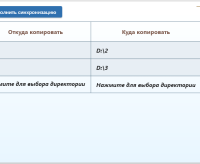

## synchronizing_directories

#### Программа для синхронизиции директорий

    

#### Описание
Приложение для операционной системы Windows.  
При установленной галочке выбора позволяет синхронизировать две директории находящиеся в одной строке.  
Синхронизация в данном приложении односторонняя, из директории "Откуда копировать" в директорию  
"Куда копировать", будут скопированы все отсутствующие папки и файлы, существующие файлы с более  
ранней датой модификации будут автоматически заменены.
  
Все настройки (выбор директории, выбор строк для синхронизации, высота и ширина окна приложения)  
сохраняются при нажатии кнопки "Выполнить синхронизацию" и будут применены при следующем запуске  
приложения.
  
Кнопка  __+__  добавляет в конец таблицы строку с приглашением ввести необходимые папки и выбрать  
данную строку для синхронизации, установив галочку.