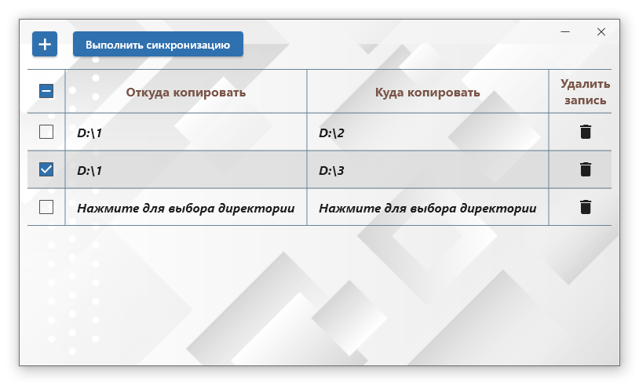

## synchronizing_directories

#### Программа для синхронизиции директорий

    

#### Описание
Приложение для операционной системы Windows.  
При установленной галочке выбора позволяет синхронизировать две директории находящиеся в одной строке.  
Синхронизация в данном приложении односторонняя, из директории "Откуда копировать" в директорию  
"Куда копировать", будут скопированы все отсутствующие папки и файлы, существующие файлы с более  
ранней датой модификации будут автоматически заменены.
  
Установки пользователя (выбор директории, выбор строк для синхронизации) сохраняются при нажатии  
кнопки "Выполнить синхронизацию" и будут восстановлены при следующем запуске приложения.  
При нажатии на кнопку закрытия окна, также сохраняются высота и ширина окна приложения, положение  
на экране монитора.
  
Кнопка  __+__  добавляет в конец таблицы строку с приглашением ввести необходимые папки и выбрать  
данную строку для синхронизации, установив галочку.